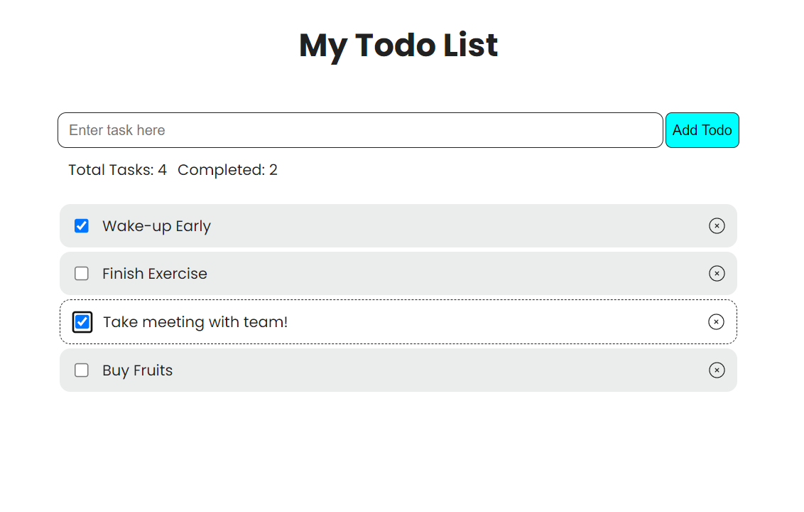

# Todolist using @reduxjs/toolkit

[Project on StackBlitz ⚡️](https://stackblitz.com/edit/vitejs-vite-xkp9fp)

# Todo List ReactJs

Simple Todo List App developed in React.Js.

### Tools I used:

- React.js
- Vite
- React Redux
- ReduxJs-Toolkit

### Features

- Simply add a new task to perform to todo-list.
- Status of Total Tasks and Completed tasks in list.
- Delete button to remove a task from list.
